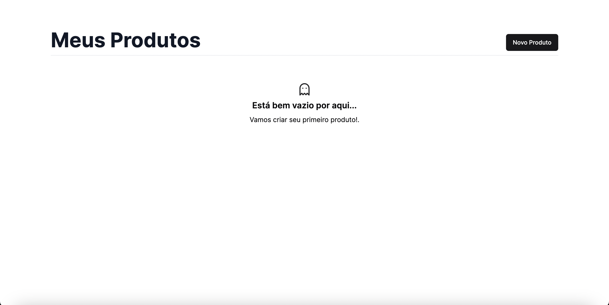
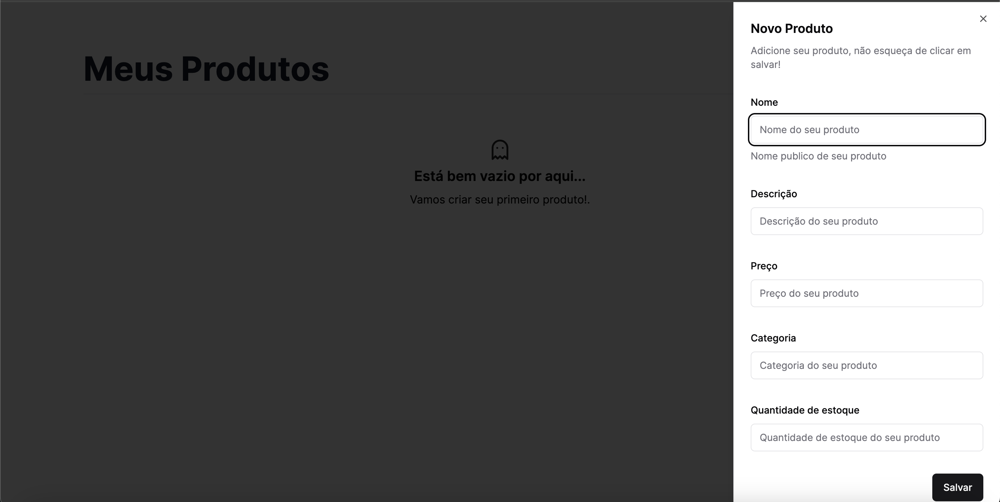
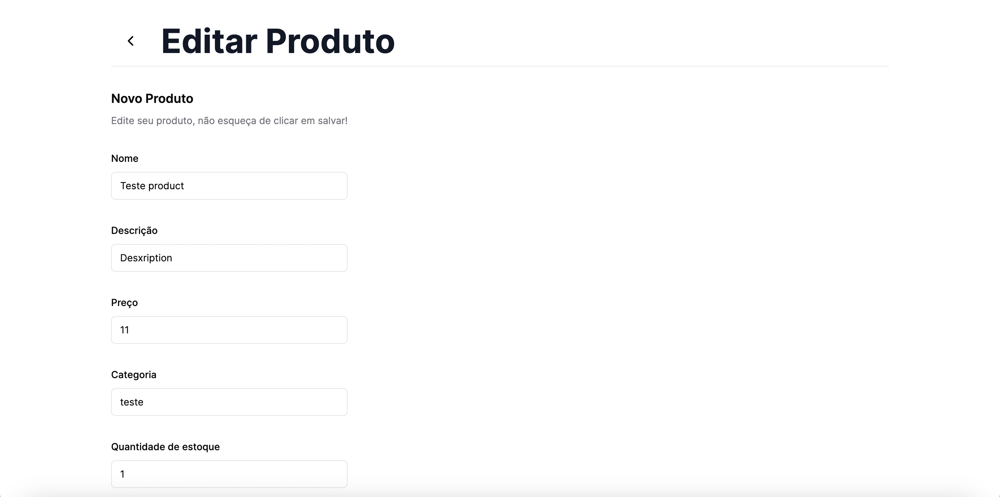
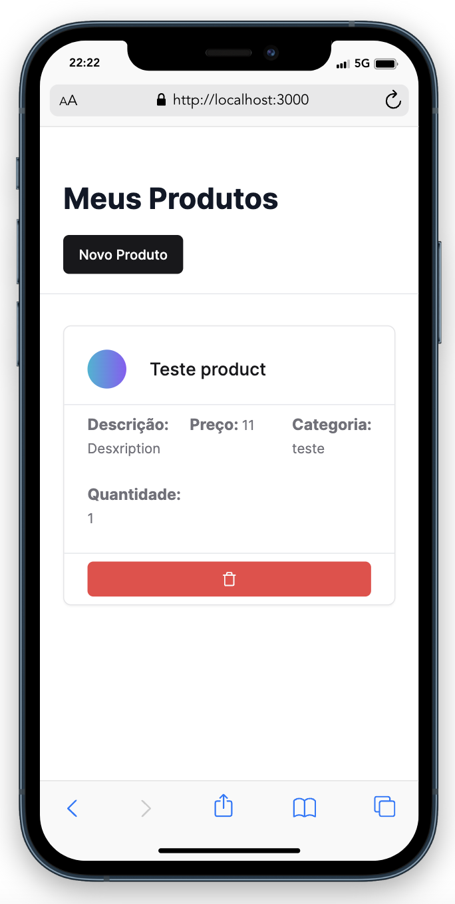

Teste Técnico para Desenvolvedor Full-Stack DFCOM

## Como rodar

# Importante!

Para rodar o sistema completo você vai precisar executar o [Backend](https://github.com/jovimoura/nestjs-crud) e ter a seguinte .env: 

```
API_URL="http://localhost:3333"
```

Primeiro instale as dependencias do projeto:

```bash
npm install
# ou
yarn
# ou
pnpm i
# ou
bun i
```

Segundo, rode o projeto com:

```bash
npm run dev
# ou
yarn dev
# ou
pnpm dev
# ou
bun dev
```

Abra [http://localhost:3000](http://localhost:3000) com seu browser para ver o resultado

## Dashboard

Aqui você pode ver todos os produtos



## Cadastrar novo produto

Clique em Novo produto para abrir o Sheet Modal e preencha as informações para criação do novo produto:



## Editar produto

Clique no produto para abrir a tela de edição:



## Deletar produto

Clique no icone de lixeira para deletar o produto

## Mobile

Versão mobile: 



---

<a href="https://www.linkedin.com/in/jovimoura10/" target="_blank" align="left" style="font-style: italic;">
  Desenvolvido por John
</a>

<a href="https://jovimoura.vercel.app/" target="_blank" align="left" style="font-style: italic;">
  Portfolio
</a>